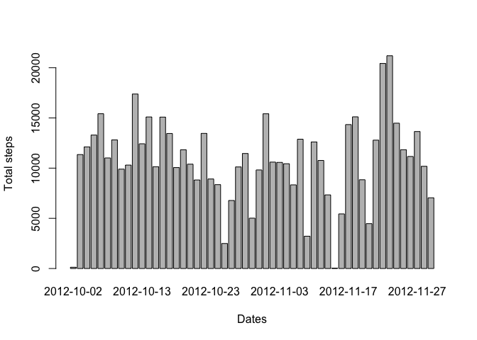
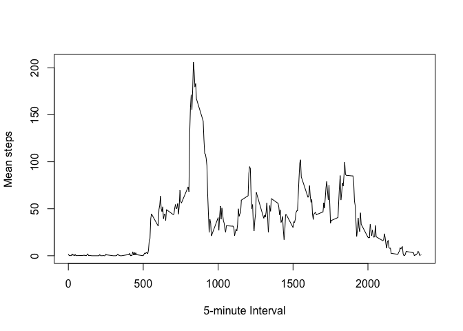
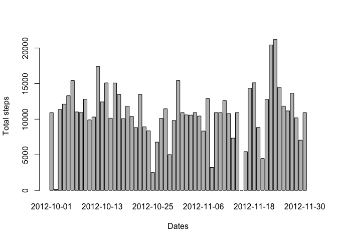
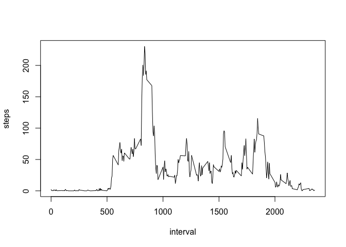
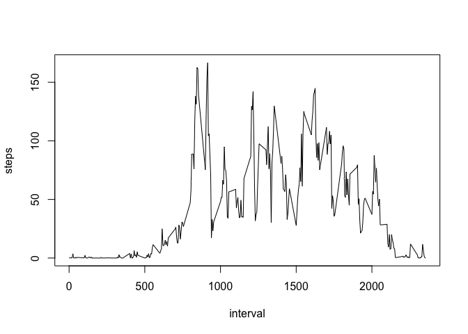

# Reproducible Research: Peer Assessment 1


## Loading and preprocessing the data


```r
activity_zip <- "activity.zip"
activity_csv <- "activity.csv"

if(!file.exists(activity_csv)){
  unzip(activity_zip)
}

activity_data <- read.csv(activity_csv)
activity_data$date <- as.Date(activity_data$date, "%Y-%m-%d")
```

## What is mean total number of steps taken per day?

### Steps per days


```r
steps_per_day <- aggregate(steps ~ date, data = activity_data, FUN = sum)
barplot(steps_per_day$steps,names.arg=steps_per_day$date,xlab="Dates",ylab="Total steps")
```

 

### Mean steps per days is :


```r
mean(steps_per_day$steps)
```

```
## [1] 10766.19
```

### Median steps per days is :


```r
median(steps_per_day$steps)
```

```
## [1] 10765
```

## What is the average daily activity pattern?

### Steps per interval


```r
steps_per_interval <- aggregate(steps ~ interval, data = activity_data, FUN = mean)
colnames(steps_per_interval) <- c("interval", "steps")
plot(steps_per_interval, type="l", xlab="5-minute Interval", ylab="Mean steps")
```

 

### Interval with max number of steps


```r
index <- which.max(steps_per_interval$steps)
steps_per_interval$interval[index]
```

```
## [1] 835
```

## Imputing missing values

### Number of missing data


```r
sum(is.na(activity_data))
```

```
## [1] 2304
```

### Cleaning data with NA


```r
clean_activity_data <- data.frame(activity_data$steps)
clean_activity_data[is.na(clean_activity_data),] <- ceiling(tapply(X=activity_data$steps,INDEX=activity_data$interval,FUN=mean,na.rm=TRUE))
clean_activity_data <- cbind(clean_activity_data, activity_data[,2:3])
colnames(clean_activity_data) <- c("steps", "date", "interval")
activity_data <- clean_activity_data
```

### Steps per days


```r
steps_per_day <- aggregate(steps ~ date, data = activity_data, FUN = sum)
barplot(steps_per_day$steps,names.arg=steps_per_day$date,xlab="Dates",ylab="Total steps")
```

 

### Mean steps per days is :


```r
mean(steps_per_day$steps)
```

```
## [1] 10784.92
```

### Median steps per days is :


```r
median(steps_per_day$steps)
```

```
## [1] 10909
```


## Are there differences in activity patterns between weekdays and weekends?

### Separate by week day and week end


```r
daytype <- function(day) {
    if (as.POSIXlt(day)$wday %in% c(0, 6)) {
        "weekend"
    } else {
        "weekday"
    }
}
activity_data$daytype <- as.factor(sapply(activity_data$date, daytype))
```

### Weekday intervals


```r
weekday_intervals <- aggregate(steps ~ interval, data = activity_data, subset = activity_data$daytype == "weekday", FUN = mean)
plot(weekday_intervals, type = "l")
```

 

### Weekend intervals


```r
weekeend_intervals <- aggregate(steps ~ interval, data = activity_data, subset = activity_data$daytype == "weekend", FUN = mean)
plot(weekeend_intervals, type = "l")
```

 
